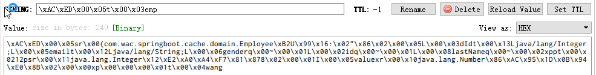

### 使用Redis作为缓存

---------

#### 安装redis：
registry.docker-cn.com/library/redis
sudo docker run -d -p 6379:6379 --name myredis registry.docker-cn.com/library/redis

#### 配置application：

```yml
spring:
	redis:
  		host: 192.168.142.128
```

#### 向redis中保存对象

需要保存对象实现序列化如 ：public class Employee implements Serializable 


一、默认的类序列化器：new JdkSerializationRedisSerializer()

```
defaultSerializer = new JdkSerializationRedisSerializer
```

保存到redis中的效果如下图：




二、自定义序列化器：添加Redis配置类

```JAVA
@Bean
public RedisTemplate<Object, Employee> empRedisTemplate(
            RedisConnectionFactory redisConnectionFactory) throws UnknownHostException {
        RedisTemplate<Object, Employee> template = new RedisTemplate<>();

        Jackson2JsonRedisSerializer<Employee> serializer = new 			Jackson2JsonRedisSerializer<Employee>(Employee.class);
        template.setConnectionFactory(redisConnectionFactory);
        template.setDefaultSerializer(serializer);
        return template;
}
```

**Jackson2JsonRedisSerializer**


#### 实践

