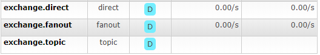
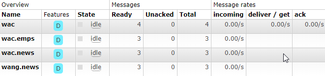

安装

sudo docker pull registry.docker-cn.com/library/rabbitmq:3-management

sudo docker run -d -p 5672:5672 -p 15672:115672 --name myrabbitmq a829a97a0435

http://192.168.142.128:15672

user:guest

password:guest

